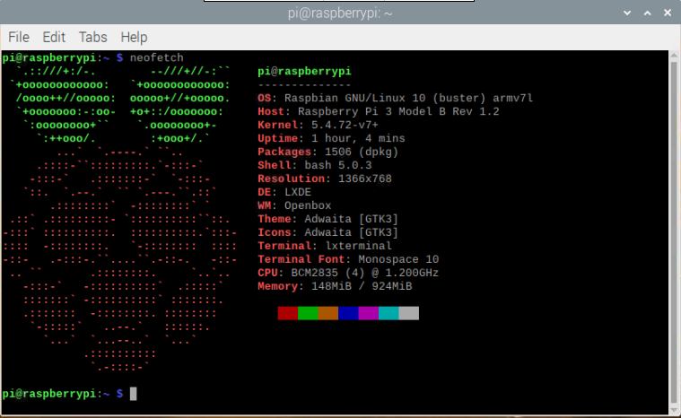

# AI-Rasp-Project

## Steps
[Installing OpenCV4 on Raspberry Pi](https://gist.github.com/willprice/abe456f5f74aa95d7e0bb81d5a710b60)

[Installing TensorFlow 2.3 on Raspberry Pi](https://itnext.io/installing-tensorflow-2-3-0-for-raspberry-pi3-4-debian-buster-11447cb31fc4)
